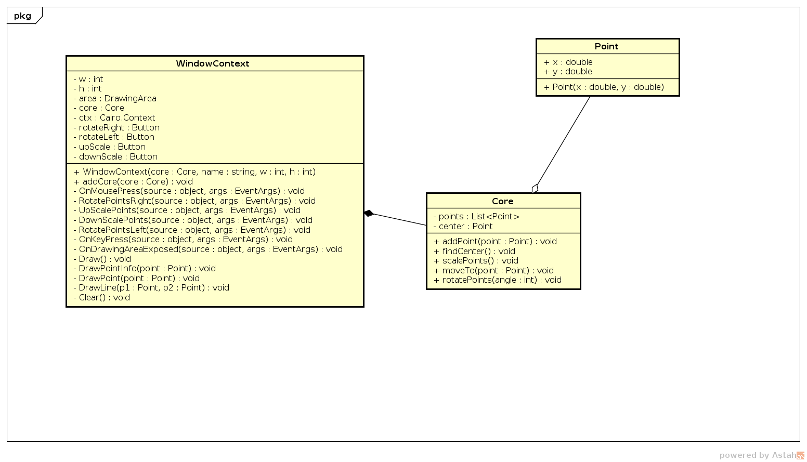

# MatrixSharp

A simple program to demonstrate 2D transformations writed in C#.


## Project Architecture


This project uses mono compiler, Gtk-Sharp and Cairo to show a window and draw.

The project is divide in 3 classes:

- Point
  - Representation 2D of a point in Eucledian space
- Core
  - Core of application, contains the transformations
- WindowContext
  - The Display handler class, display a window with Gtk and draw the points and handles the mouse and keyboard inputs, aka Graphic Interface.


## Install

To use you need first install the dependencies.

### Linux

###### Dependencies

ArchLinux:

```b
$ pacman -S mono gtk-sharp-2 
```


## Compile and Run

To run the project you need first compile with mono:

```
$ ./compile.sh
```

If no error execute

```
$ mono App.exe
```


## Class Diagram


